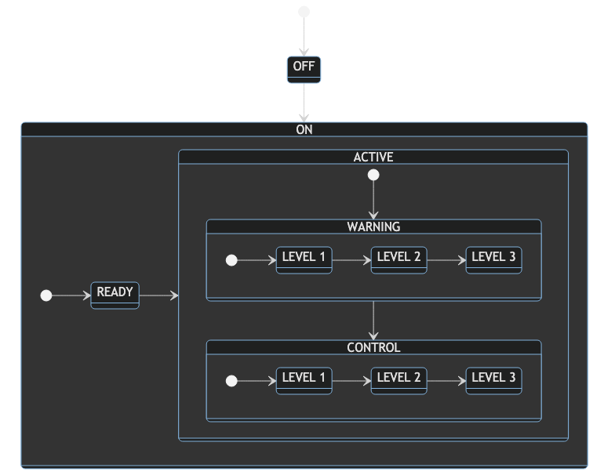

# mermaid.js usage

## Dependency
- install mermaid-cli for mac OS
   ```
   brew install mermaid-cli
   ```

## Tutorial
1. edit graph.mmd file
2. run mermaid-cli to make image file from graph.mmd
```
mmdc -i graph.mmd -o output.png -t dark -b transparent
```
3. check the image file


## Reference
- [Mermaid.js](https://mermaid-js.github.io)